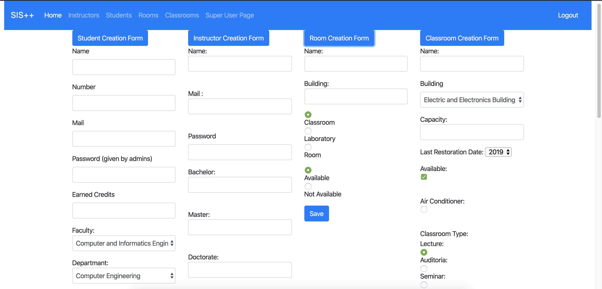
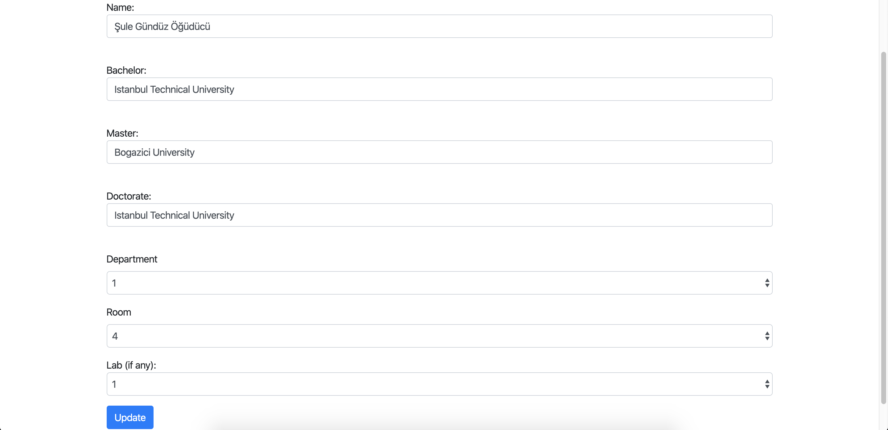
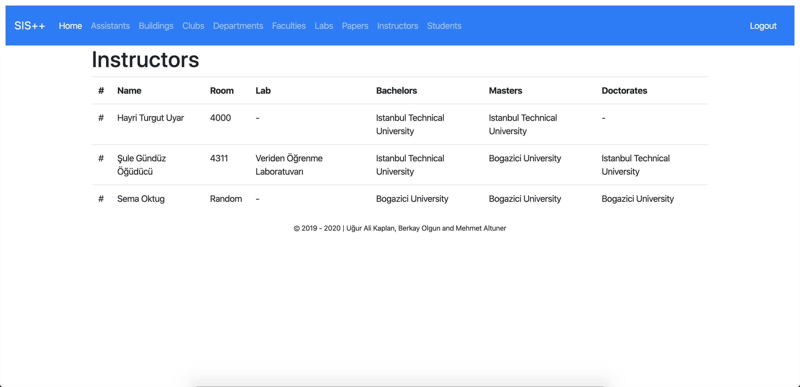
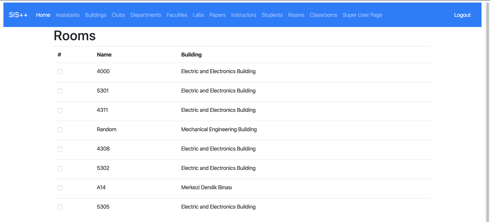
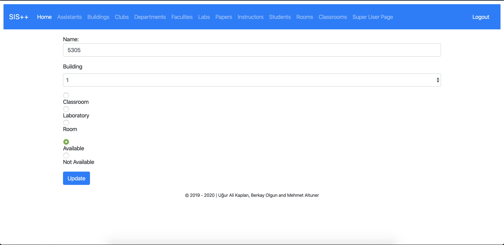
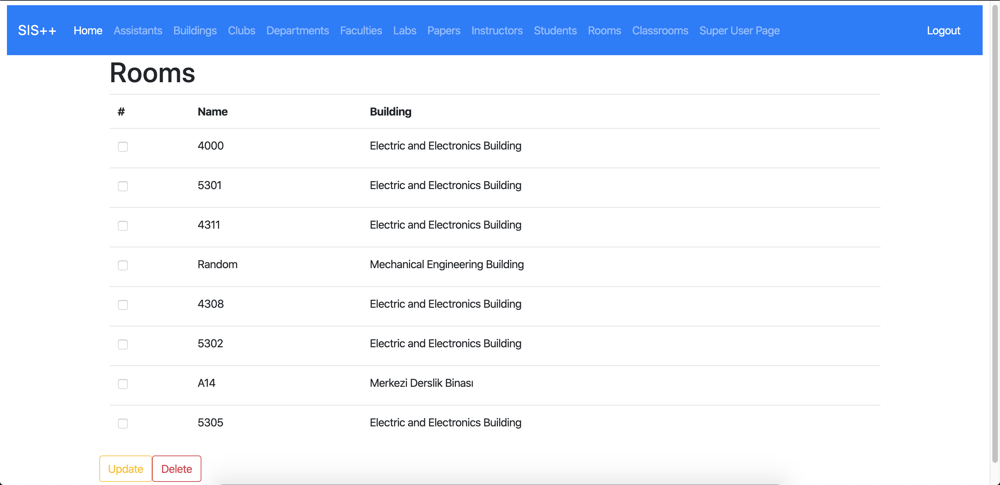
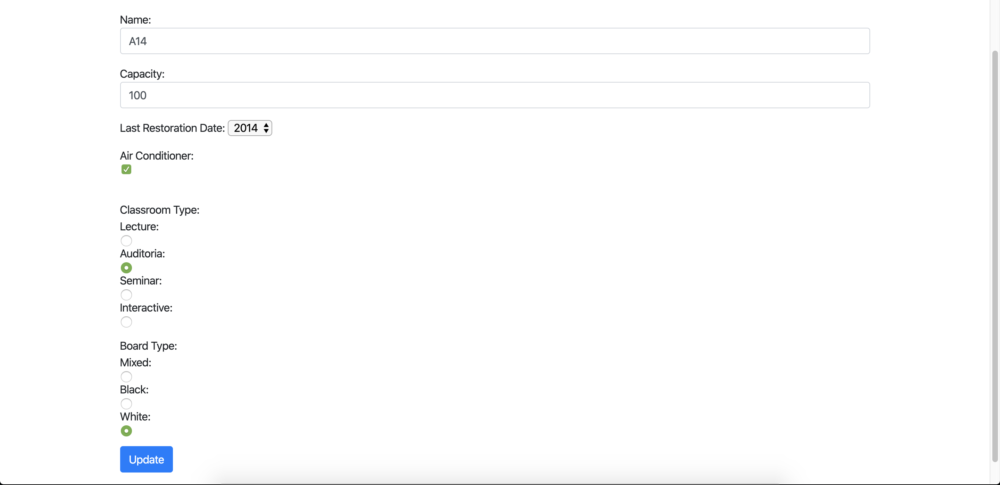
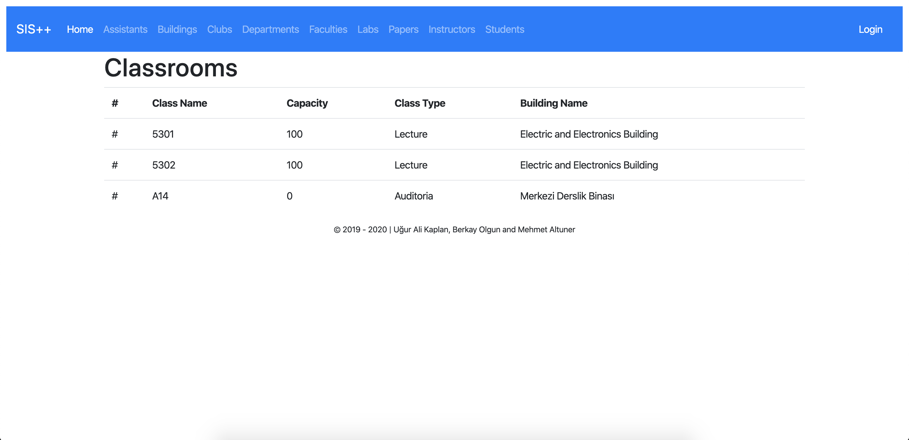

Parts Implemented by Berkay
================================

This page will be providing information on

Instructors
Rooms
Classrooms

1. Instructors
--------------

Instructors page visible to all users.

Navigate to Instructors page by clicking the *Instructors* button on the navbar.

In order to perform operation on Instructors, you must login and have permission.
Once those are provided, you are eligible to operate on Instructors in our system and this page should be
visible to you.

1.1. Adding a New Instructor
~~~~~~~~~~~~~~~~~~~~~~~~~~~~

	
	Super User Page

From the blue boxes, pick *Instructors* dropdown form will be opened, provide the necessary information
about the instructor in relative boxes below. Once you have provided all the information, click *Submit*
button to finalize the process and add the instructor.

.. warning:: The room of an instructor must exist before it's instructor.

1.2. Updating an Existing Instructor
~~~~~~~~~~~~~~~~~~~~~~~~~~~~~~~~~~~~~~~~~~~~

From the checkboxes, pick one and hit the button *UPDATE*. Then, change the information that
you would like to update and then click *Update* button to end the process and update the Instructor.

.. tip:: If you check more than one boxes you update only the first one with that operation

	
	Instructor Update Page
	
1.3. Viewing and Deleting Existing Instructors
~~~~~~~~~~~~~~~~~~~~~~~~~~~~~~~~~~~~~~~~~~~~~~~

To view the instructors come to the page instructors. If you want to delete them,
then, check the checkboxes that you want delete and press the *DELETE* button to 
end the process and delete the given Instructor.

	
	Instructors Page

2. Rooms
------------------

Navigate to Rooms Companies page by clicking the *Rooms* button on the navbar.

.. note:: Rooms are only visible in navbar to admins.

In order to perform operation on rooms or see the buttons, you must login and have permission.
Once those are provided, you are eligible to operate on Rooms in our system and this page should be
visible to you.

.. tip:: The word room is used like a synonym to a place in this application.

	
	Rooms Page
	
2.1. Adding a New Room
~~~~~~~~~~~~~~~~~~~~~~~~~~~~~~~~~~~~~~~~~~~~

	
	Super User Page

From the blue boxes, pick *Room* dropdown form will be opened, provide the necessary information
about the room in relative boxes below. Once you have provided all the information, click *Submit*
button to finalize the process and add the room.

2.2. Updating an Existing Room
~~~~~~~~~~~~~~~~~~~~~~~~~~~~~~~~~~~~~~~~~~~~

From the checkboxes, pick one and hit the button *UPDATE*. Then, change the information that
you would like to update and then click *Update* button to end the process and update the Room.

.. tip:: If you check more than one boxes you update only the first one

	
	Rooms Update
	
2.3. Viewing and Deleting Existing Rooms
~~~~~~~~~~~~~~~~~~~~~~~~~~~~~~~~~~~~~~~~~~~~

To view the Rooms come to the page Rooms. If you want to delete them,
then, check the checkboxes that you want delete and press the *DELETE* button to 
end the process and delete the given Room.

	
	Rooms

3. Classrooms
------------------

Navigate to Classrooms Companies page by clicking the *Classrooms* button on the navbar.

.. note:: Classrooms are only visible in navbar to admins.

In order to perform operation on rooms or see the buttons, you must login and have permission.
Once those are provided, you are eligible to operate on Rooms in our system and this page should be
visible to you.
	
3.1. Adding a New Classroom
~~~~~~~~~~~~~~~~~~~~~~~~~~~~~~~~~~~~~~~~~~~~

	
	Super User Page

From the blue boxes, pick *Classroom* dropdown form will be opened, provide the necessary information
about the instructor in relative boxes below. Once you have provided all the information, click *Submit*
button to finalize the process and add the Classroom.

3.2. Updating an Existing Classroom
~~~~~~~~~~~~~~~~~~~~~~~~~~~~~~~~~~~~~~~~~~~~

From the checkboxes, pick one and hit the button *UPDATE*. Then, change the information that
you would like to update and then click *Update* button to end the process and update the Classroom.

.. tip:: If you check more than one boxes you update only the first one

	
	Classroom Update
	
3.3. Viewing and Deleting Existing Classrooms
~~~~~~~~~~~~~~~~~~~~~~~~~~~~~~~~~~~~~~~~~~~~~~~

To view the Classrooms come to the page Classrooms. If you want to delete them,
then, check the checkboxes that you want delete and press the *DELETE* button to 
end the process and delete the given Classroom.

	
	Classrooms Page

