Parts Implemented by Uğur Ali Kaplan
=====================================

Here, you will be able to find information about how to interact
with different pages of our website, SİS++ using various web forms.

Focus of this document is going to be these pages:

* Papers
* Labs
* Faculties
* Departments
* Clubs
* Buildings
* Assistants

Actually, all of these have the same logic. So, if you understand how
to use one, you will be able to understand how to use the others except
for the form you have to use when dealing with papers.

So, first two entries will be explained in detail and rest will be a series
of screenshoots since there is no new information to add and it would make
a really redundant documentation.

Let's start with the complicated one, papers.

Papers
------------------------------

Papers, as you can guess from its name lets you learn about various
authors and their papers.

If you were to go into papers page, you will see a box that asks you
to pick an author. Then, if a name in the database has papers, you will
be able to see their names in this list and learn more about their papers.

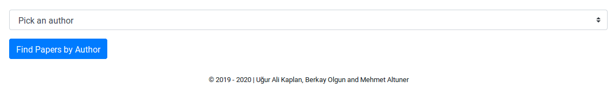
    
    Picking author

If a person does not have a paper registered in the database, you will not
be able to see their name in this list.

After picking an author, you can see their papers listed as shown here:

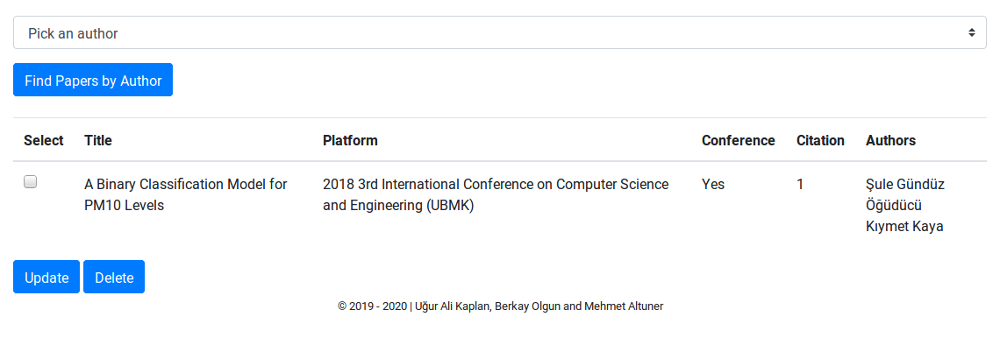

    Papers by author

Now, you can pick an entry from this table and hit delete or update. If you
hit delete and you have multiple authors, you will see that paper is still in
the database yet its authors does not include the author you have used to 
reach this listing.

As an example, let's say you choose "Uğur Ali Kaplan" as the author. And you
pick a paper, with authors "Uğur Ali Kaplan", "Berkay Olgun" and "Mehmet Altuner".
If you delete this paper, now when you pick "Berkay Olgun" as the author, you will
still be able to see the paper. What is different is however, that you will not
see "Uğur Ali Kaplan"s name listed along names of "Berkay Olgun" and "Mehmet Altuner".

Other than that, if you choose to update the papers, you will meet with a screen
such as the one below:

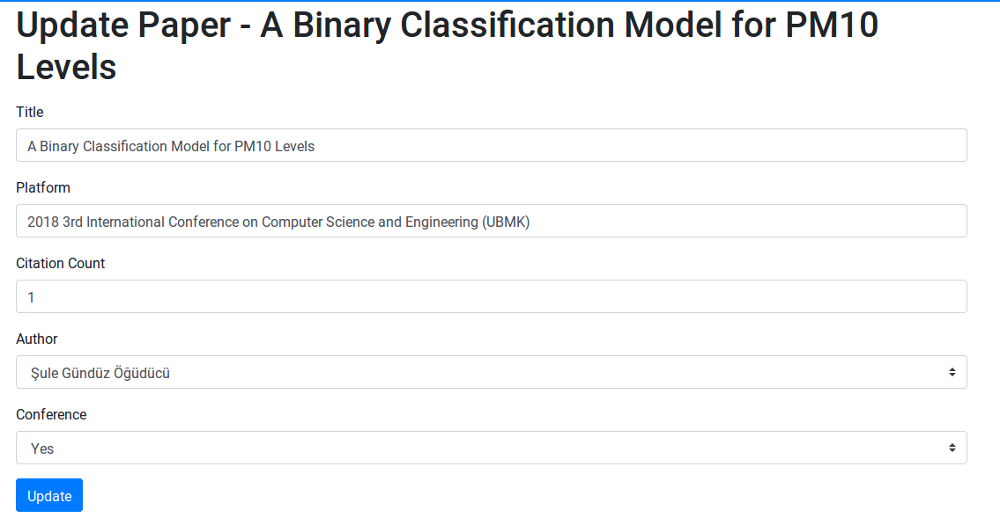

    Updating papers

As in the case of deleting, changes you make in paper updates are local. So, if you change the name
of the paper, name of the paper will only be different for this author and other entries
will not be affected.

As it is the case for all the other tables, if you wish to create an entry for papers you
will have to use the super user page.

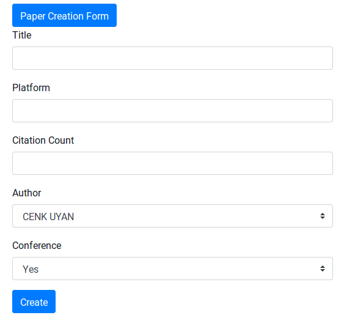

    Creating papers

If you fill the form and hit create, new entry will be created. In this case, you can choose any person
that has an entry in the database. If your database do not have an entry for the person you want to
attribute the paper to, you have to create a person for it. Details of how to create a person can be found
in other pages of this documentation.

Labs
------------------------------

You can see, update and delete labs in the university from labs page. Also, if you wish to create a new lab,
you can use the super user page.

When you enter into labs page, you will see the following:

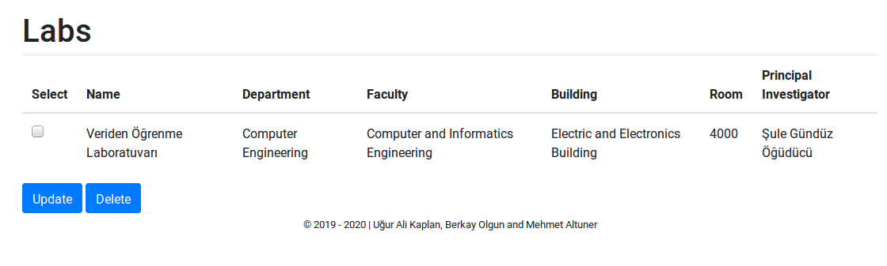

    Labs page

You can pick one of the labs and hit delete or update. Delete is as straigthforward as it goes, it deletes the
chosen entry. Be careful, because there is no "Are you sure?" popping out in our system, we trust you.

If you wish to update the entries, again you can choose the entry you want to update and you will see a similar
page to the image below:

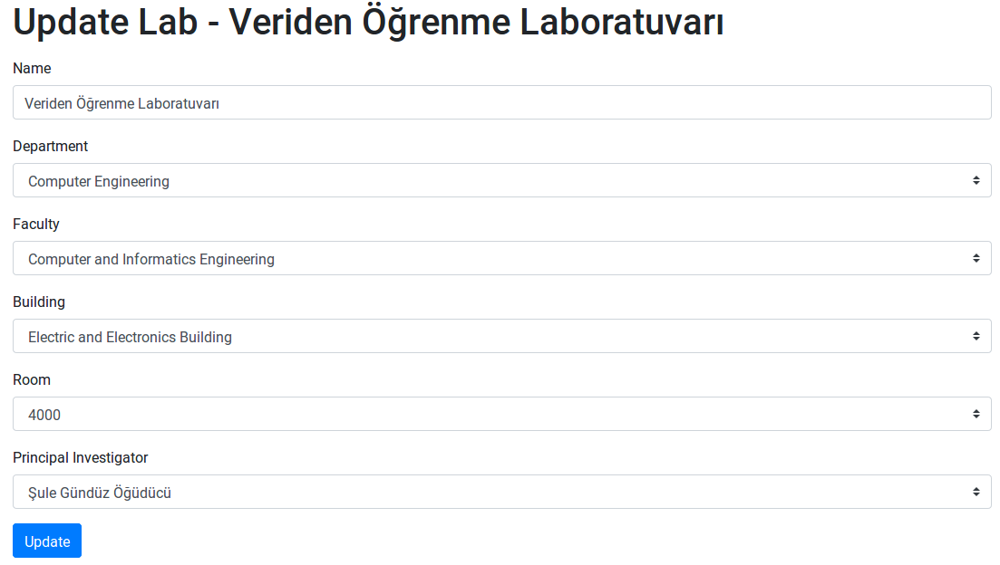

    Updating labs

You can enter update the information and hit the update button.

To create a new lab never seen before, as opposed to update one, you have to use the super user page.
In the super user page, find the one that says "Lab Creation Form" and create a new lab by clicking
the "Create" button after filling the necessary information.

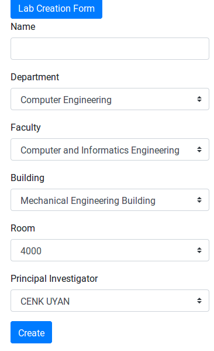

    Creating labs

Faculties
------------------------------

You can list the faculties under the faculties page. From this page, you can also delete or update
the entries you choose.

To create a new faculty, you have to go to the super user page.

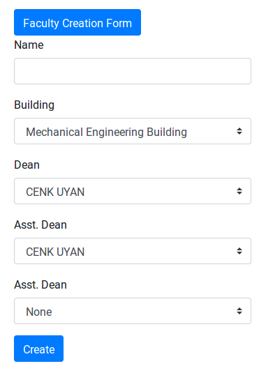

    Creating faculties

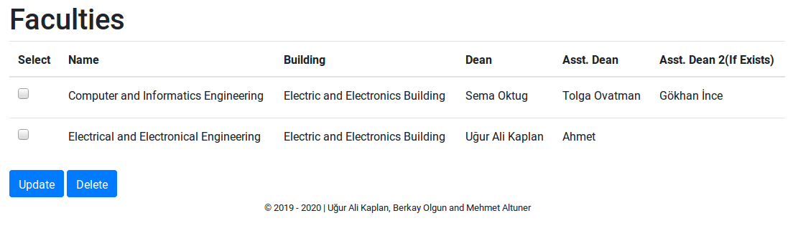

    Faculties page

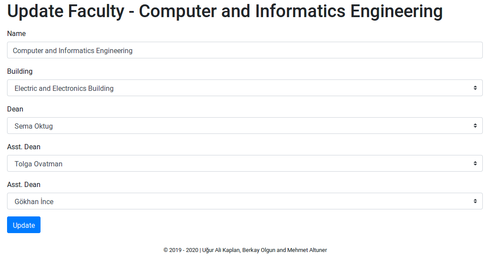

    Updating faculties

Departments
------------------------------

You can list the departments under the departments page. From this page, you can also delete or update
the entries you choose.

To create a new department, you have to go to the super user page.

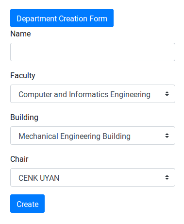

    Creating departments

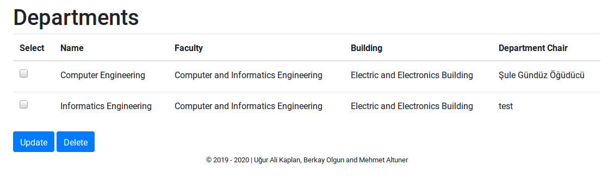

    Departments page

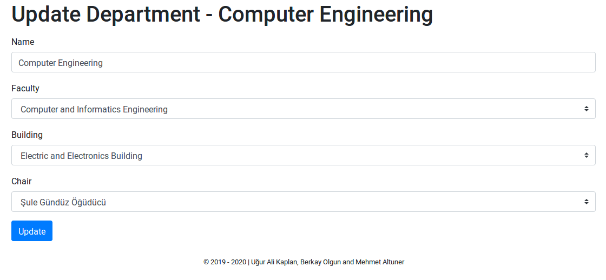

    Updating departments

Clubs
------------------------------

You can list the clubs under the faculties page. From this page, you can also delete or update
the entries you choose.

To create a new club, you have to go to the super user page.

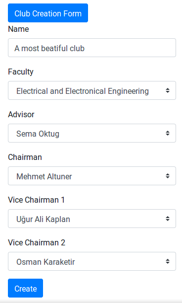

    Creating clubs

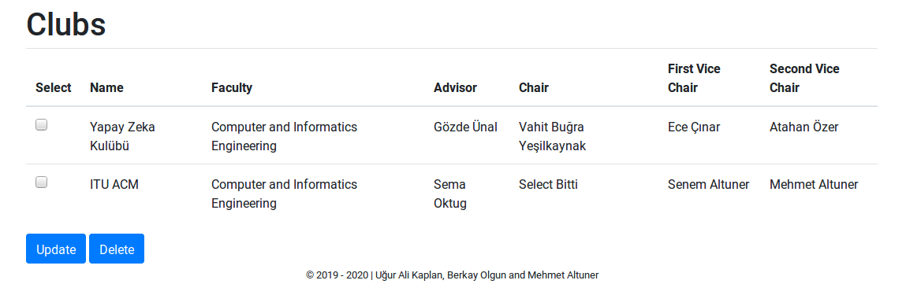

    Clubs page

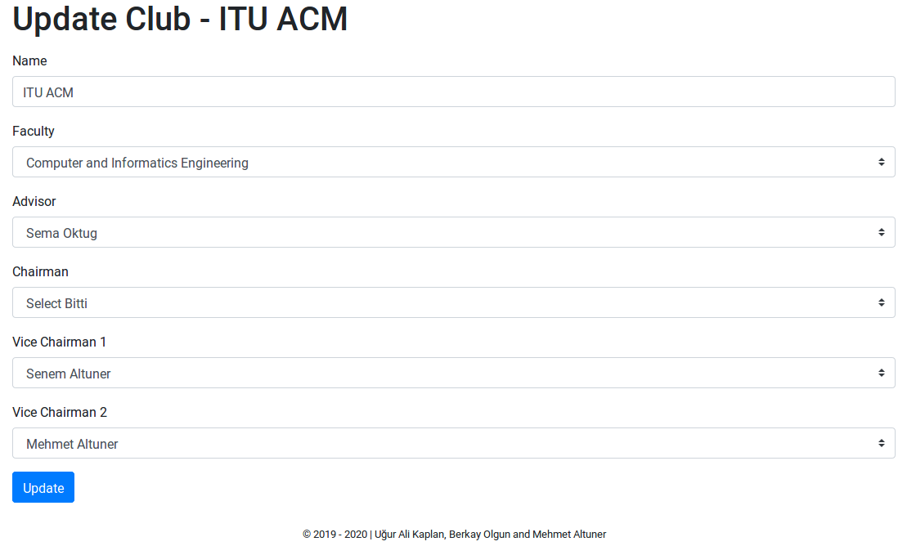

    Updating clubs

Buildings
------------------------------

You can list the faculties under the buildings page. From this page, you can also delete or update
the entries you choose.

To create a new building, you have to go to the super user page.

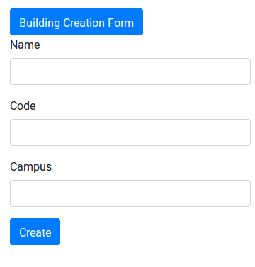

    Creating buildings

.. figure:: kaplan/buildingslist.png
    :scale: 70%
    :alt: Building Listing

    Buildings page

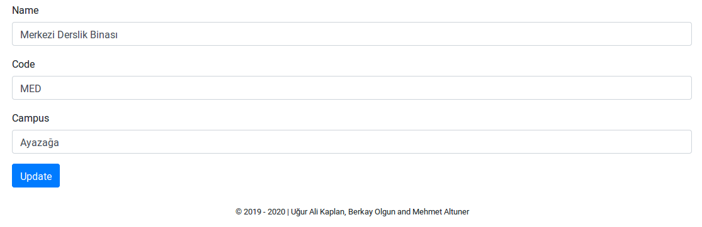

    Updating buildings

Assistants
------------------------------

You can list the faculties under the assistants page. From this page, you can also delete or update
the entries you choose.

To create a new assistant, you have to go to the super user page.

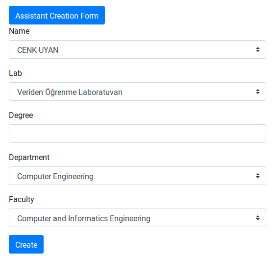

    Creating assistants

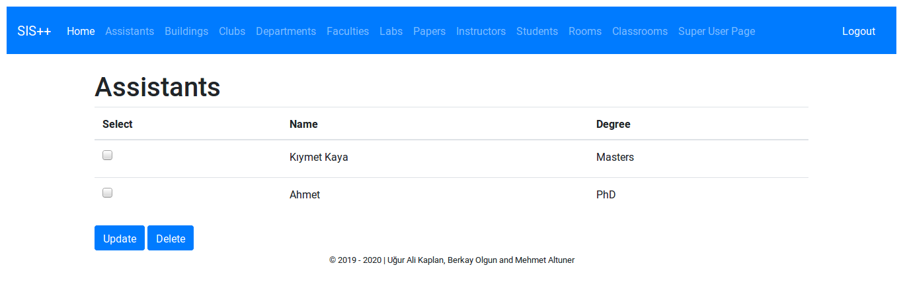

    Assistants page

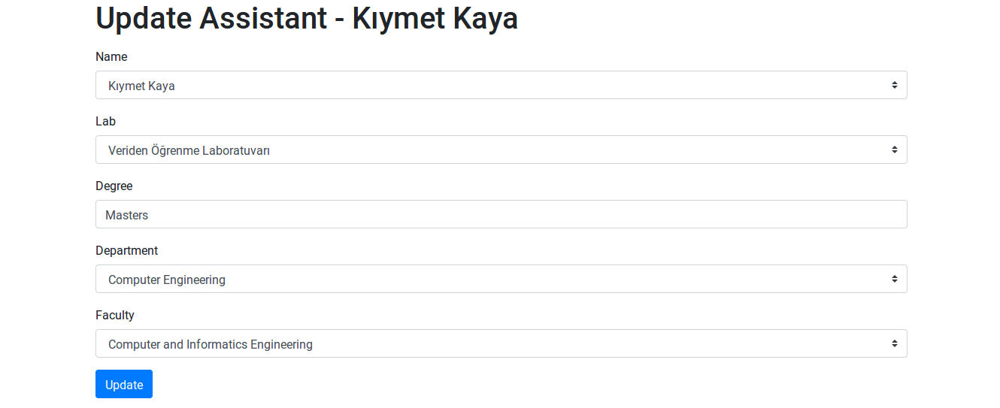

    Updating assistants

