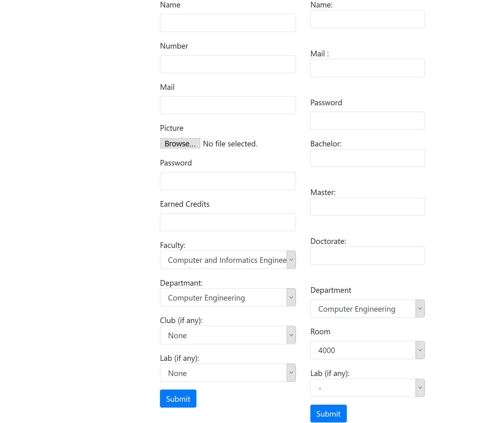
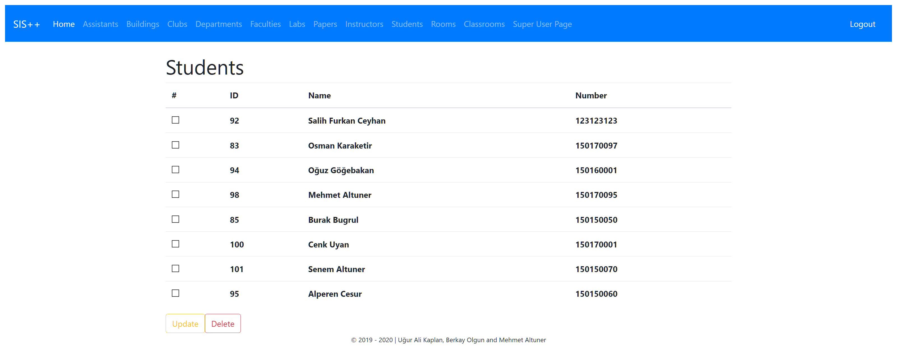
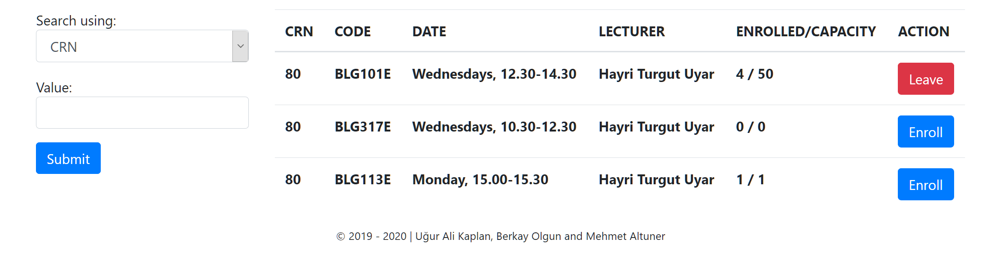

Parts Implemented by Mehmet Altuner
================================

This page will be providing information on

People
Students
Lessons

1. People
--------------
People table is the base model that students, lecturers, assistants are inherited from.

1.1. Adding a New Instructor
~~~~~~~~~~~~~~~~~~~~~~~~~~~~

:scale: 30 %
:alt: Super User Page
:align: center
	
	Super User Page

This page contains bunch of html forms that makes super user be able to create entities. You cannot directly create a person object but students, instructors etc. will create a user before creating People object.

1.2. Updating an Existing People Object
~~~~~~~~~~~~~~~~~~~~~~~~~~~~~~~~~~~~~~~~~~~~

If you are logged in as a super user account, you can update the information of the people you have selected.

.. tip:: If you check more than one boxes you update only the first one with that operation
.. tip:: Since you cannot update person object themselves, student update page is shown as an example

	
	Student Update Page

1.3. Viewing and Deleting Existing People
~~~~~~~~~~~~~~~~~~~~~~~~~~~~~~~~~~~~~~~~~~~~~~~

If you are logged in as a super user account, you can delete the people you have selected.

.. tip:: If you check more than one boxes you can delete all the objects you selected
.. tip:: Since you cannot delete person object themselves, student update page is shown as an example

	
	Student Delete Page

2. Students
------------------

Navigate to Students page by clicking the *Student* button on the navbar.

:scale: 30 %
:alt: Students Page
:align: center

Students Page

2.1. Adding a New Student
~~~~~~~~~~~~~~~~~~~~~~~~~~~~~~~~~~~~~~~~~~~~
In order to add a new student, you must be logged in as an admin user. After logging in, navigate to the super user page in which you can create new students.

2.2. Updating an Existing Student
~~~~~~~~~~~~~~~~~~~~~~~~~~~~~~~~~~~~~~~~~~~~

In the *Students* page, a different UI is shown to admins. Through the select boxes and update button, you can update students.
.. tip:: If you check more than one boxes you update only the first one with that operation

	
	Student Update Page

2.3. Deleting Existing Rooms
~~~~~~~~~~~~~~~~~~~~~~~~~~~~~~~~~~~~~~~~~~~~

In the *Students* page, a different UI is shown to admins. Through the select boxes and delete button, you can delete students.
.. tip:: If you check more than one boxes you delete only the first one with that operation

	
	Student Update Page

3. Lessons
------------------

There is not a page in which you can list all of the lessons. Instead, we have implemented a search functionality that students can access in *Enroll* page. You can access to the *Enroll* page from the *Home* page if you are logged in as a student account.

	
	Enroll Page

	

3.1. Enrolling
~~~~~~~~~~~~~~~~~~~~~~~~~~~~~~~~~~~~~~~~~~~~

After you get to the *Enroll* page, first thing you need to do is to search for the lessons you want to enroll by either its crn or instructor's name. If there is enough capacity, you can enroll to lessons by clicking Enroll button. You can also leave the lessons you are already enrolled within the same UI.

	
	Enroll Page

	

3.2. Adding a New Lesson
~~~~~~~~~~~~~~~~~~~~~~~~~~~~~~~~~~~~~~~~~~~~

In order to add a new lesson, you must be logged in as an admin user. After logging in, navigate to the super user page in which you can create new lessons.

